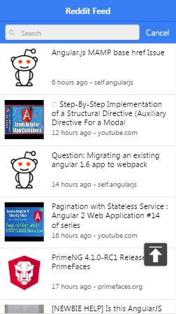
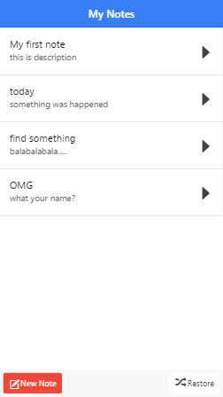

# MyApp
## redditNews App
- search keyword like angularjs,python,android
- press header for update the news(pull-to-refresh is not compatible in my andro
- infinite scroll down
- the back-to-top button
### Results are as follows

## notepad App
- support the CRUD opreation
- reset the order by drag
- store the data in localStorage
### Results are as follows

