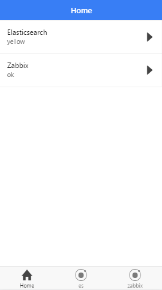
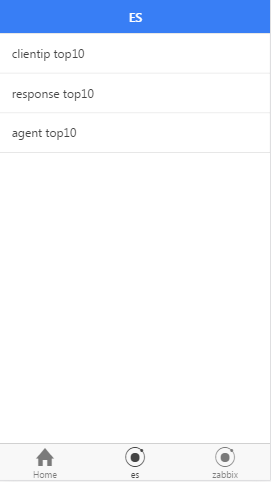
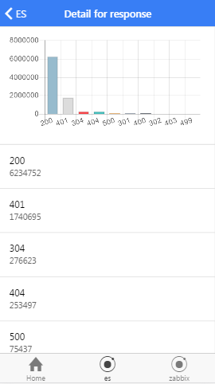
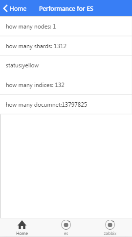

# MyApp
## redditNews(ionic v1)
- search keyword like angularjs,python,android
- press header for update the news(pull-to-refresh is not compatible in my andro
- infinite scroll down
- the back-to-top button
### Results are as follows

## notepad(ionic v1)
- support the CRUD opreation
- reset the order by drag
- store the data in localStorage
### Results are as follows

## myops(ionic v1)
- the mobile client of ops
- check es status
- plot data of es
### Results are as follows

